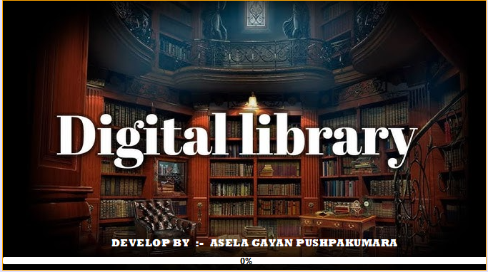
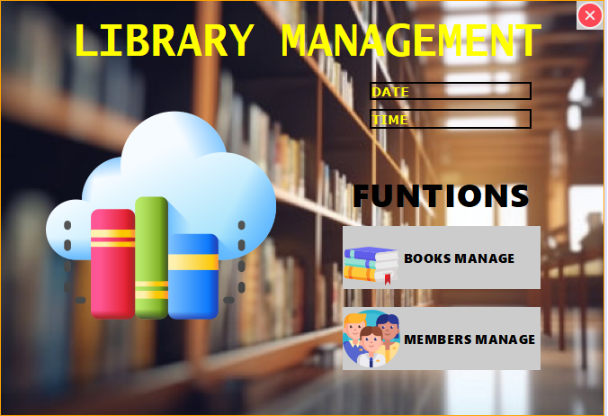
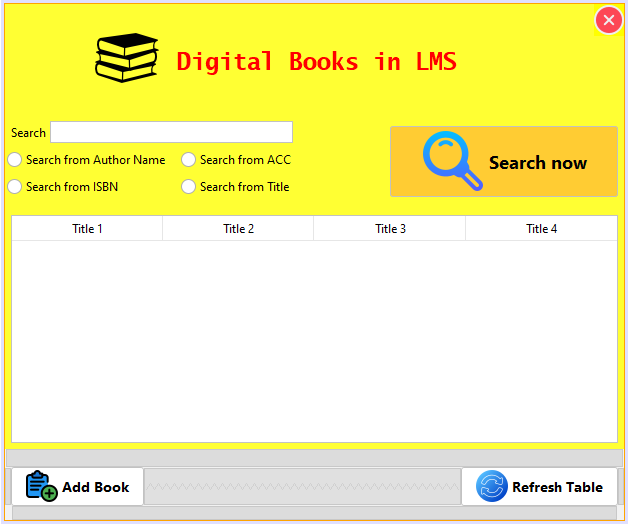
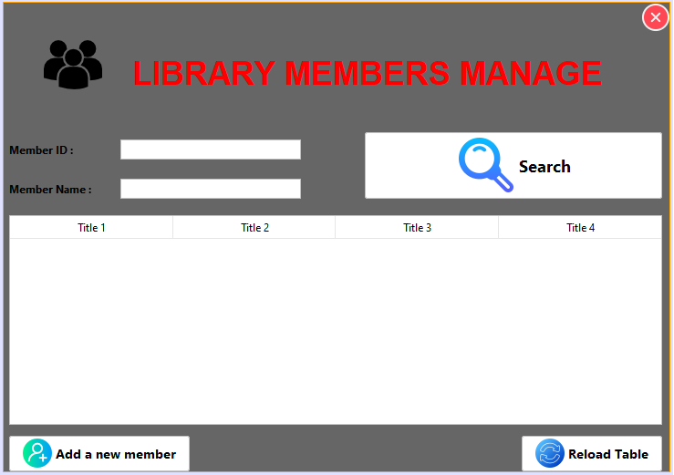

# ** DIGITAL LIBRARY MANAGEMENT **

The main objective of this project is to provide a complete automated Library by digitizing its
each and every functionality. Starting from the book-keeping, issuing of books, fine
generation, advance booking and report generation all will be accomplished under one single
project. The project will be a web based project with a database server responsible for
maintaining every single detail of the Library. It has a very user friendly interface which can
easily be operated by any non-technical person.
This is a 2nd task to built a <b>DIGITAL LIBRARY MANAGEMENT</b> Java Development Internship at <b>Code-Casa
</b> 
I constructed this project by using Java and adding GUI (Java Swing GUI) to make it more interesting.

## **Build** 📜
 To run the project, the device must have:
 - Java JDK (Used JDK version 18.0.2)
 - Apache Netbeans IDE 18

## **Game Screenshots** 📷

	
	
  
	

## **Contribution** 🔥
If you wish to help improve this project, fork this repo and submit your own pull request.  
If you discover a problem with this project, please report it to the issue page. Thank you very much 😊

## **Thank you** 💖
If you like this project just click ⭐ and share it with others.
